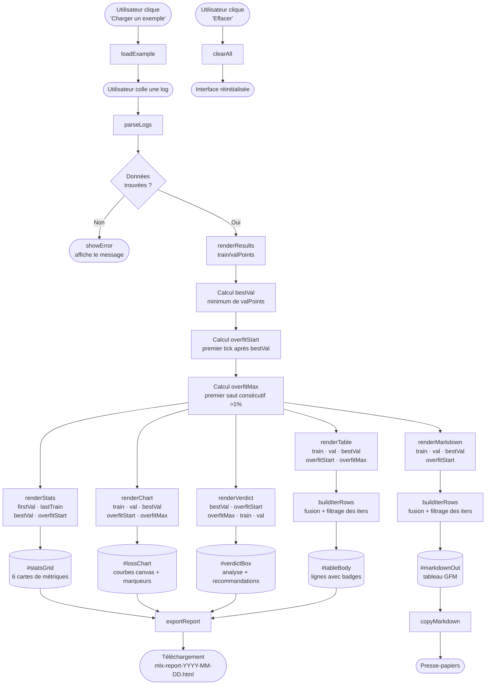

# Diagramme de flux — MLX Log Parser

```mermaid
flowchart TD
    A([Utilisateur colle une log]) --> B[parseLogs]
    A2([Utilisateur clique\n'Charger un exemple']) --> L[loadExample]
    L --> A

    B --> ERR{Données\ntrouvées ?}
    ERR -- Non --> E([showError\naffiche le message])
    ERR -- Oui --> C[renderResults\ntrain/valPoints]

    C --> D1[Calcul bestVal\nminimum de valPoints]
    D1 --> D2[Calcul overfitStart\npremier tick après bestVal]
    D2 --> D3[Calcul overfitMax\npremier saut consécutif >1%]

    D3 --> R1[renderStats\nfirstVal · lastTrain\nbestVal · overfitStart]
    D3 --> R2[renderChart\ntrain · val · bestVal\noverfitStart · overfitMax]
    D3 --> R3[renderVerdict\nbestVal · overfitStart\noverfitMax · train · val]
    D3 --> R4[renderTable\ntrain · val · bestVal\noverfitStart · overfitMax]
    D3 --> R5[renderMarkdown\ntrain · val · bestVal\noverfitStart]

    R4 --> BI1[buildIterRows\nfusion + filtrage des iters]
    R5 --> BI2[buildIterRows\nfusion + filtrage des iters]

    R1 --> O1[(#statsGrid\n6 cartes de métriques)]
    R2 --> O2[(#lossChart\ncourbes canvas + marqueurs)]
    R3 --> O3[(#verdictBox\nanalyse + recommandations)]
    BI1 --> O4[(#tableBody\nlignes avec badges)]
    BI2 --> O5[(#markdownOut\ntableau GFM)]

    O5 --> CP[copyMarkdown]
    CP --> O6([Presse-papiers])

    O1 & O2 & O3 & O4 --> EX[exportReport]
    EX --> O7([Téléchargement\nmlx-report-YYYY-MM-DD.html])

    A3([Utilisateur clique\n'Effacer']) --> CL[clearAll]
    CL --> O8([Interface réinitialisée])
```
