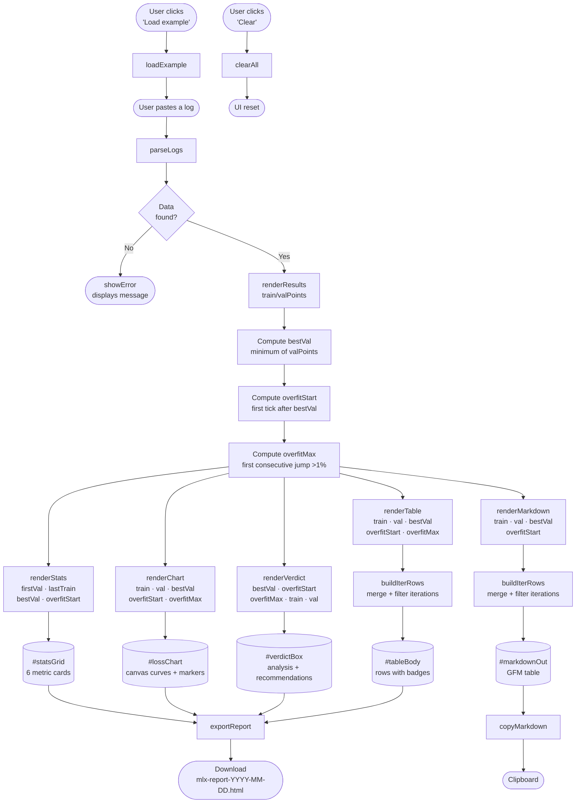

# Flow Diagram — MLX Log Parser

```mermaid
flowchart TD
    A([User pastes a log]) --> B[parseLogs]
    A2([User clicks\n'Load example']) --> L[loadExample]
    L --> A

    B --> ERR{Data\nfound?}
    ERR -- No --> E([showError\ndisplays message])
    ERR -- Yes --> C[renderResults\ntrain/valPoints]

    C --> D1[Compute bestVal\nminimum of valPoints]
    D1 --> D2[Compute overfitStart\nfirst tick after bestVal]
    D2 --> D3[Compute overfitMax\nfirst consecutive jump >1%]

    D3 --> R1[renderStats\nfirstVal · lastTrain\nbestVal · overfitStart]
    D3 --> R2[renderChart\ntrain · val · bestVal\noverfitStart · overfitMax]
    D3 --> R3[renderVerdict\nbestVal · overfitStart\noverfitMax · train · val]
    D3 --> R4[renderTable\ntrain · val · bestVal\noverfitStart · overfitMax]
    D3 --> R5[renderMarkdown\ntrain · val · bestVal\noverfitStart]

    R4 --> BI1[buildIterRows\nmerge + filter iterations]
    R5 --> BI2[buildIterRows\nmerge + filter iterations]

    R1 --> O1[(#statsGrid\n6 metric cards)]
    R2 --> O2[(#lossChart\ncanvas curves + markers)]
    R3 --> O3[(#verdictBox\nanalysis + recommendations)]
    BI1 --> O4[(#tableBody\nrows with badges)]
    BI2 --> O5[(#markdownOut\nGFM table)]

    O5 --> CP[copyMarkdown]
    CP --> O6([Clipboard])

    O1 & O2 & O3 & O4 --> EX[exportReport]
    EX --> O7([Download\nmlx-report-YYYY-MM-DD.html])

    A3([User clicks\n'Clear']) --> CL[clearAll]
    CL --> O8([UI reset])
```
